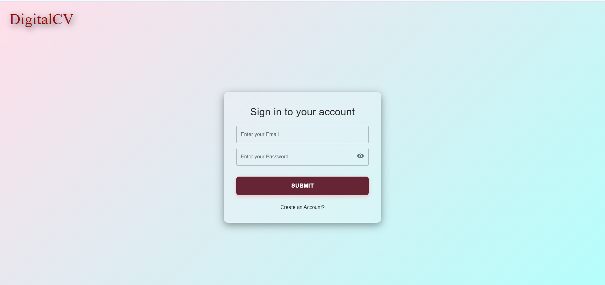

# Digital Resume

This project is a **React-based** web application designed to help users create and manage their resumes digitally. It provides a user-friendly interface for creating, editing, and sharing resumes in various formats. The application utilizes **React.js**, **Context API/Redux** for state management, **Node.js** with **Express.js** for the backend, **EJS** for server-side rendering (if required), **Prisma ORM** for database interactions, and **PostgreSQL** as the primary database.

---

## Version

The version is specified in the Dockerfile. Please do not use any other version.

---

## Features

- **User Authentication**: Secure sign-up and login functionalities.
- **Resume Creation**: Users can create resumes by entering personal, professional, and educational information.
- **Resume Templates**: Multiple customizable resume templates available.
- **Dashboard**: Centralized dashboard to view and manage resumes.
- **Download Resumes**: Download resumes in various formats.
- **Share Profiles**: Share resumes via email or social media.
- **Profile Editing**: Edit personal details, profile photo, and more.

---

## Tech Stack

- **React.js**: JavaScript library for building user interfaces.
- **Node.js + Express.js**: Backend framework used for API development and server-side logic.
- **EJS**: Template engine for server-side rendering (used where required).
- **Prisma**: ORM for interacting with the PostgreSQL database.
- **PostgreSQL**: Relational database system to store resume and user data.

---

## Installation

Clone this Repository

```bash
git clone https://github.com/AmTripathiDev/Digital-Resume-Frontend.git
cd Digital-Resume-Frontend
npm install
npm start
```

> Make sure the backend server is running and connected to your PostgreSQL database.

---

## Use Docker

Docker simplifies the setup and eliminates the need to install dependencies manually.

```bash
git clone https://github.com/AmTripathiDev/Digital-Resume-Frontend.git
cd Digital-Resume-Frontend
docker build -t <your-image-name> .
docker run -p 5000:5000 -v .:/src/frontend <your-image-name>
```

